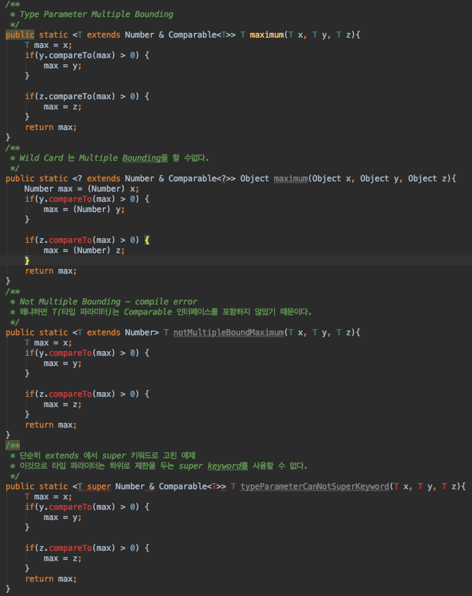

# Java - Generic


> 각 관련 개념의 예제는 다음의 경로에서 확인이 가능하다  
> [관련 예제 패키지](https://github.com/GodChiken/JavaTheory/tree/master/src/main/java/com/kbh/desk/theory/basic/generic)

* 개요    
  * Java 5 부터 추가  
  * 클래스, 인터페이스, 메소드를 정의시 Type 을 파라미터로 사용할 수 있도록한다.  
* 장점
  * 컴파일 시 강한 타입 체크를 할 수 있다.  

    > 잘못된 타입이 사용될 수 있는 문제를 컴파일 과정에서 제거할 수 있다.

  * Casting 과정을 제거한다.

    > 제네릭을 활용하지 않고 사용하는 경우, 객체를 읽고 쓰는 과정에서 캐스팅 과정이 필요로 한다.\`

    ```java
    List list = new ArrayList(); 
    list.add("hello"); 
    String str = (String) List.get(0);

    List list = new ArrayList;
    list.add("hello"); 
    String str = list.get(0);
    ```
* 제네릭 타입
  * class, interface 과 같은 타입\(T\)을 파라미터로 가지는 클래스와 인터페이스를 의미한다.
  * "타입 파라미터는 변수명과 동일한 규칙에 따라서 작성이 가능하나 일반적으로 대문자 하나만 쓴다" 라고  
    하길래 무슨 소릴 하는건지 보아하니 다음을 의미 하는 것 같다.

    ```java
    public class 클래스명<T>
    public interface 인터페이스명<T>

    public class 클래스명<AnyThingVariableNaming>           ----> 변수명 쓰듯 쓰는게 가능
    public interface 인터페이스명<AnyThingVariableNaming>    ----> 마찬가지
    ```

    > "&lt;&gt;" 안에는 자바에서 변수명 규칙과 동일하게 정할 수 있다. 하지만 통상 대문자 한 글자로 정하는 편이다.  
    > 위와같은 이유는 타입 파라미터를 일반 클래스 및 인터페이스와 구분하기 어렵기 떄문이다. 그리고 통상 타입 파라미터의 정의로 쓰는 것은 다음과 같다.

    ```text
    E - Element (used extensively by the Java Collections Framework)
    K - Key
    N - Number
    T - Type
    V - Value
    S,U,V etc. - 2nd, 3rd, 4th types
    ```

  * 제네릭 타입을 쓰는 이유는 제네릭 타입을 쓰지 않고 모든 타입을 저장하려는 경우 Object 를 사용할 수 있으나 이럴 경우 Casting 과정을 겪기 때문이다.  
    성능상 좋지 못한 결과가 나오기 때문에 제네릭 타입은 좋은 해결책이 되어준다.

    ```java
    public class Box<T> {
        private T t;

        public T get() {
            return t;
        }

        public void set(T t) {
            this.t = t;
        }
    }
    ```

  * 위와 같이 클래스를 제네릭 타입으로 구성 후 자신이 사용하고자 하는 클래스를 제네릭 타입으로 지정하여 사용하면 내부적으로 자동으로 재구성 된다고 한다.

    ```java
    Box<String> box = new Box<String>;

    public class Box<String> {
        private String t;

        public String get() {
            return t;
        }

        public void set(String t) {
            this.t = t;
        }
    }
    ```

  * 결론적으로, **실제 클래스가 사용될 때 구체적인 타입을 지정하여 타입변환을 최소화 하기 위한 목적으로 활용**한다.
* 원천 타입 \(Raw Type\)
  * 제네릭 타입에는 원천 타입\(Raw Type\) 이 존재한다.

    ```java
    List<String> list; ----> 일반적인 제네릭타입 형식의 컬렉션
    List list2          ----> Raw Type
    ```

  * 위와 같을 경우 list2 같은 경우 문제가 발생한다. 그에 대한 예제는 다음과 같다.

    ```java
    public class RawType<T> {
      public List<String> getStrs() {
          return Arrays.asList("str");
      }
      public static void main(String[] args) {
          RawType t = new RawType();          ---->> Raw Type
          for (String str : t.getStrs()) {    ---->> compile error
              System.out.println(str);
          }
      }
    }
    ```

  * 컴파일 에러내용은 incompatible types: Object cannot be converted to String 이고,   

    getStr 은 String Type Prameter를 가지는 List 을 반환하는데 어째서 에러가 나는 것인가?

  * Raw Type 으로 선언되면, 해당 클래스에 정의된 모든 생성자, 인스턴스 메서드, 인스턴스 필드의 타입 파라미터를 인식하지 않기 때문이다.
  * 결론적으로 이야기해서 제네릭스 타입을 가지는 클래스를 활용시 제네릭스 타입을 빼먹지 말자.
* 멀티 타입 파라미터
  * 제네릭 타입은 여러 개로 구성 될 수 있다.
* 제네릭 메소드
  * 제네릭 메소드는 파라미터 타입, 리턴 타입으로 타입 파라미터를 갖는 메소드를 의미한다

    ```java
    public <타입파라미터,...> 리턴타입 메소드명(매개변수,...) {...}
    public <T> Box<T> boxing(T t) {...}
    ```

  * 두가지 방식으로 호출할 수 있다. 코드에서 타입 파라미터의 구체적인 타입을 명시적으로 지정하거나  
    컴파일러가 매개값의 타입을 보고 구체적인 타입을 추정하도록 하는 방법이 있다.

    ```java
    리턴타입 변수 = <구체적인 타입> 메소드명(매개값);
    리턴타입 변수 = 메소드명(매개값);

    Box<Integer> box = <Integer>boxing(100);
    Box<Integer> box = boxing(100);
    ```

  * 결론적으로 리턴 타입 앞에오는 제네릭스로 표현된 타입 파라미터를 매개변수에도 동일하게 표현하여 사용하면 된다.
* 제한된 타입 파라미터
  * 타입 파라미터에 지정되는 구체적인 타입을 제한해야 하는 경우 사용
  * 예를들어 숫자를 연산하는 제네릭 메소드는 매개값으로 숫자와 관련된 인스턴스만 소유해야한다.   

    ```java
    public <T extends Number> int compare(T t1, T t2) {...}
    ```
* 와일드카드 타입
  * "?" : 모든 클래스와 인터페이스 타입을 소유할 수 있다.  
  * "&lt;? extends 상위타입&gt;" : 상위타입 제한방식으로 상위타입 자신과 상위타입을 상속받는 클래스를 소유하게 한다.  
  * "&lt;? super 하위타입&gt;" : 하위타입 제한방식으로 하위타입과 하위타입의 상위타입을 소유하게한다.
  * 말이 참 어렵자만 결론적으로 extends,super 뒤에 지정되는 타입을 기준으로 하여 부모로 제한할지 자식으로 제한할지 정하는 것으로 이해하면 될것 같다. 
* 제네릭 타입의 상속과 구현
  * 제네릭 타입도 다른 타입의 부모 클래스가 될 수 있다.

    ```java
    public class Product<T> {...}   
    public class ChildProduct<T,M> extends Project<T> {...}
    public class EtcProduct<T,M,C> extends ChildProduct<T,M> {...}
    ```

  * 이렇게 늘려갈 수도 있겠지만, 애초에 설계시 이런 식으로 확장해 나가는 방식을 고수하진 않을 것 같다.
* 타입 파라미터와 제네릭 와일드 카드의 차이점은 무엇인가?
  * 와일드 카드는 제네릭의 제한을 상위와 하위 타입으로 제한할 수 있는 반면 오직 상위 타입으로만 제한할 수 있다. 이 말은 곧 타입 파라미터는 super 키워드를 활용하여 제한할 수 없다.
  * 타입 파라미터는 Multiple Bounding 이 가능하지만 와일드 카드는 불가하다.   



* [https://stackoverflow.com/questions/18176594/when-to-use-generic-methods-and-when-to-use-wild-card](https://stackoverflow.com/questions/18176594/when-to-use-generic-methods-and-when-to-use-wild-card)
* [제네릭에 관하여 최고로 정리가 잘된\(?\) 것 같은 곳도 링크](https://www.tutorialspoint.com/java_generics/java_generics_multiple_bounds.htm)
* [https://futurecreator.github.io/2018/08/12/java-generics/?fbclid=IwAR1TC0J\_r5hI3vJ-lcN-QVK4UBFIDKP6byWnZM9cbSyMjFmN3cvIuHwW5C4](https://futurecreator.github.io/2018/08/12/java-generics/?fbclid=IwAR1TC0J_r5hI3vJ-lcN-QVK4UBFIDKP6byWnZM9cbSyMjFmN3cvIuHwW5C4)

