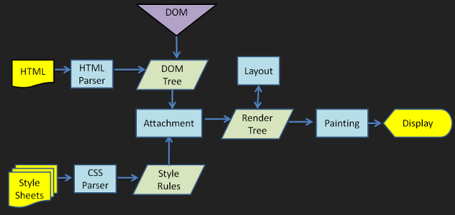
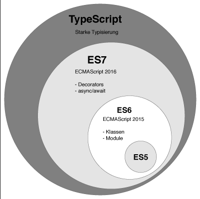

# 2019 feconf

#### [https://blog.woolta.com/categories/9/posts/192](https://blog.woolta.com/categories/9/posts/192) 에도 2019feconf 내용이 잘 정리 되어있다.

## 팀장님: 우린 내일부터 React + TypeScript로 갑니다.

### 왜 선택했나

* 자체적인 js 프레임워크인 Woowahan JS\(???\)를 사용하고 있었다.
* 그러나 backbone.js, jquery에 대한 의존성이 너무 강했다고한다.
  * backbone.js 에 대한 문제는 못 들었으나, jquery 에서의 dom 조작의 경우 사이드 이펙트에 대한 측정이 불가능 했다고 한다.
* 미흡한 테스트 환경과 개발도구도 한 몫을 했다고 한다.
* 또한 자체 개발 프레임워크를 공부하자고 하니, 별도의 러닝커브가 발생했다고 한다.
* 성능도 별로라고 한다.
* 다들 쓰니까의 느낌으로 접근한다기 보다 좋은 제품을 만들기 위한 기준을 정하고 결정했다고 한다.
  * 좋은 제품의 8 가지 기준 \(Garvin, David A. Managing Quality: The Strategic and Competitive Edge, Free Press, 1988\)
    1. 성능 \(Performance\) - 더 빠르고 효과적인 어플리케이션 
    2. 특징 \(Feature\) - 제공하는 기능과 활용성
    3. 신뢰성 \(Reliability\) - 안정성
    4. 일치성 \(Conformance\) - 코드에 대한 신뢰
    5. 내구성 \(Durability\) - 코드의 수명
    6. 서비스성 \(Serviceability\) - 유지보수성
    7. 심미성 \(Aesthetics\) - 가독성
    8. 고객이 느끼는 품질 \(Perceived Quality\) - 핵심 결과물
* 어딜가든 누구에게 듣든지, 동일한 소리를 많이 들었다 **리액트는 프레임워크가 아닌 라이브러리** 라는 점이다.
  * 기술 선택이 자유롭다.
  * 컴포넌트 단위 개발하기 적합하다.
  * 다양한 라이브러리, 프레임워크와 활용이 가능하다.
  * 가볍게 뷰 렌더링만 사용 시에도 적합하다.
* JSX 의 선언적인 구조 덕에 가독성과 유지보수성을 얻었다곤 했다만 정말 그런지는 잘 모르겠다.
* Virtual DOM 기반의 렌더링 연산 처리 과정으로 성능적 향상을 얻었다고 한다.
  * 일반적인 브라우저에서의 DOM Rendering process는 다음과 같다.\([좀 더 상세한 자료는 이곳에서 확인이 가능하다.](https://www.html5rocks.com/en/tutorials/internals/howbrowserswork/)\)
  * 직접 DOM을 수정하는 경우 attachment =&gt; render tree & layout =&gt; painting =&gt; display 등의 과정이 연산이 요청마다 이루어지기에 비 효율적이게 된다.
  * React는 위 rerender flow를 타지 않는 Virtual DOM을 만들고 수정한 결과물을 DOM에 전달한다.



* 그래서 많고 많은 장점들이 있어서 매력을 느꼈다한다.
  * 다양한 dev tool & debug enviroment
  * one store 사용으로 인한 time-travel
  * 테스트 환경 및 도구
  * 함수형 컴포넌트
  * SSR

### 왜 TypeScript 인가



* 자바스크립트의 표준을 지원을 하고 표준을 어긋나지 않게 확장된 슈퍼셋 이기 때문이다.
* 정적 타입을 제공하여 안정성을 제공한다고 한다.
  * 일반적인 자바 스크립트라면 의도된 결과를 얻지 않는 경우가 존재한다.
  * ```javascript
    const getSum = (a,b) => a+b;
    getSum('x','y');
    //'xy'
    ```
  * typescript 라면 충분히 정적타입을 통해 방지가 가능하다.
  * ```typescript
    const sum = (a : number, b: number) => a+b;
    getSum('x','y');
    //error
    ```
  * 컴파일 단계에서 타입체크, 변수와 함수의 타입추론이 가능하므로 안정성을 얻을 수 있다고 한다.
* 진정한 객체지향에 한발 다가갈 수 있다고 한다.
  * private 키워드 제공
  * class, interface, generic 지
* 그외의 장점은 다음과 같다.
  * 강력하게 성장하고 있는 생태계
  * Server & Client 모두 지원
  * 빠른 디버깅
  * ES5 의 고질적인 문제를 해결한다하는데.. 이건 타입스크립트여서 된다고 볼수 없다.
* 일일이 타입 지정하는게 짜증이 날수 있다.
  * 단기간적인 측면에서 보자면 생산성이 떨어질 수 있으나, 대규모의 어플리케이션이나 협업 시 더 높은 생산성을 얻을 수 있었다고 한다. 실수 방지때문에 그런가...
  * tsconfig 라는 것으로 일종의 타협을 하는 것도 방법이라 한다.
  * 힘들어도 any는 남발하지 말라고한다.
* api 값이 하나만 바뀌어도 어려움이 있다.
  * interface, enum, type을 잘 활용 했다면 큰 공수가 안든다고 말하지만, 과연 그런가 싶기도 하다.
  * 공통적으로 사용하는 타입은 따로 분리하라고 한다.

### Trouble Shooting

* 상위 컴포넌트 외 하위 컴포넌트에서 class component를 남발하며 state, life-cycle을 활용하면 예측이 어렵다.
* 그래서 Functional Component를 사용
  * hooks, effect를 활용
  * 최소한의 단위로 쪼갠 컴포넌트를 개발시 좋다.
* 상태관리, 라우터 등의 함께 쓸 라이브러리에 대한 고찰
  * 일단 도입해서 한번 써보고 상황에 맞는 스택을 선정하자.
  * 리액트가 뷰에만 집중할 수 있도록 함께쓰는 도구들과의 결합도를 낮춰야한다.
* 항상 성능이 좋은건 아니니 오해하지 말자
  * Reconciliation을 이해하기
  * props와 state의 비교 로직은 **얕은 비교** 임을 알자
  * shouldComponentUpdate 작성, 혹은 PureComponent의 활용
  * 최적화의 핵심은 데이터의 불변성과 Reconciliation


## ES6+ 비동기 프로그래밍과 실전 에러 핸들링

* 전반적인 내용정리는 [**@sunginHwang**](https://github.com/sunginHwang) **이 도와줬음.**
* * 라이브 세션인지라 따라가기 힘들었다.
* 불러온 이미지들의 height 값을 합산한 값을 구하는 라이브 코딩이었다.
* 이미지는 onLoad 된 시점에서만 구할수 있다고 한다.
* **Promise, async/await , try/catch** 에 대한 정확한 이해 필요
* 제너레이터, 이터레이터, 이터러블을 잘 응용하면 코드의 표현력 상승 및 향상된 에러 핸들링 처리가 가능
* 순수함수에서는 별도의 타입가드를 통한 에러처리 보다 에러를 발생시키도록 두는것이 더욱 좋은 방안.
* 에러 핸들링 코드는 부수효과를 일으킬 코드쪽에서 작성하는 것이 더욱 좋은 방안.
* 불필요한 에러핸들링 효과는 오히려 에러를 숨기게 되어 에러 발생원인조차 모르게 되는 최악의 케이스로 가는 길.
* 차라리 에러를 발생시켜 이를 **sentry.io** 같은 모니터링툴에 연동해 이를 모니터링 하는게 더욱 좋은 방안\(유저 , 회사 관점\)

## React Native로 Native한 애니메이션 구현하기

## 프론트엔드에서의 마이크로 서비스 아키텍쳐

## 3달간 GitHub 스타 3K 받은 Scene.js, Moveable 오픈소스 개발기

## 글로벌 서비스를 하게 되면 겪게 될 폰트 렌더링 문제

## Vue.js 입문자가 실무에서 주의해야 할 5가지 특징

