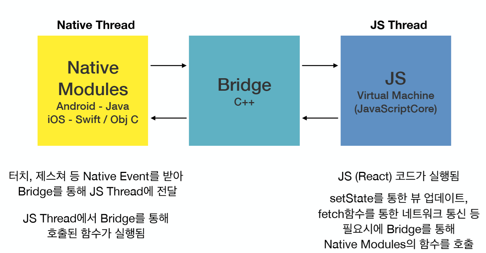

# 2019 feconf

#### [https://blog.woolta.com/categories/9/posts/192](https://blog.woolta.com/categories/9/posts/192) 에도 2019 feconf 내용이 잘 정리 되어있다.

## 팀장님: 우린 내일부터 React + TypeScript로 갑니다.

### 왜 선택했나

* 자체적인 js 프레임워크인 Woowahan JS\(???\)를 사용하고 있었다.
* 그러나 backbone.js, jquery에 대한 의존성이 너무 강했다고한다.
  * backbone.js 에 대한 문제는 못 들었으나, jquery 에서의 dom 조작의 경우 사이드 이펙트에 대한 측정이 불가능 했다고 한다.
* 미흡한 테스트 환경과 개발도구도 한 몫을 했다고 한다.
* 또한 자체 개발 프레임워크를 공부하자고 하니, 별도의 러닝커브가 발생했다고 한다.
* 성능도 별로라고 한다.
* 다들 쓰니까의 느낌으로 접근한다기 보다 좋은 제품을 만들기 위한 기준을 정하고 결정했다고 한다.
  * 좋은 제품의 8 가지 기준 \(Garvin, David A. Managing Quality: The Strategic and Competitive Edge, Free Press, 1988\)
    1. 성능 \(Performance\) - 더 빠르고 효과적인 어플리케이션 
    2. 특징 \(Feature\) - 제공하는 기능과 활용성
    3. 신뢰성 \(Reliability\) - 안정성
    4. 일치성 \(Conformance\) - 코드에 대한 신뢰
    5. 내구성 \(Durability\) - 코드의 수명
    6. 서비스성 \(Serviceability\) - 유지보수성
    7. 심미성 \(Aesthetics\) - 가독성
    8. 고객이 느끼는 품질 \(Perceived Quality\) - 핵심 결과물
* 어딜가든 누구에게 듣든지, 동일한 소리를 많이 들었다 **리액트는 프레임워크가 아닌 라이브러리** 라는 점이다.
  * 기술 선택이 자유롭다.
  * 컴포넌트 단위 개발하기 적합하다.
  * 다양한 라이브러리, 프레임워크와 활용이 가능하다.
  * 가볍게 뷰 렌더링만 사용 시에도 적합하다.
* JSX 의 선언적인 구조 덕에 가독성과 유지보수성을 얻었다곤 했다만 정말 그런지는 잘 모르겠다.
* Virtual DOM 기반의 렌더링 연산 처리 과정으로 성능적 향상을 얻었다고 한다.
  * 일반적인 브라우저에서의 DOM Rendering process는 다음과 같다.\([좀 더 상세한 자료는 이곳에서 확인이 가능하다.](https://www.html5rocks.com/en/tutorials/internals/howbrowserswork/)\)
  * 직접 DOM을 수정하는 경우 attachment =&gt; render tree & layout =&gt; painting =&gt; display 등의 과정이 연산이 요청마다 이루어지기에 비 효율적이게 된다.
  * React는 위 rerender flow를 타지 않는 Virtual DOM을 만들고 수정한 결과물을 DOM에 전달한다.


* 그래서 많고 많은 장점들이 있어서 매력을 느꼈다한다.
  * 다양한 dev tool & debug enviroment
  * one store 사용으로 인한 time-travel
  * 테스트 환경 및 도구
  * 함수형 컴포넌트
  * SSR

### 왜 TypeScript 인가


* 자바스크립트의 표준을 지원을 하고 표준을 어긋나지 않게 확장된 슈퍼셋 이기 때문이다.
* 정적 타입을 제공하여 안정성을 제공한다고 한다.
  * 일반적인 자바 스크립트라면 의도된 결과를 얻지 않는 경우가 존재한다.
  * ```javascript
    const getSum = (a,b) => a+b;
    getSum('x','y');
    //'xy'
    ```
  * typescript 라면 충분히 정적타입을 통해 방지가 가능하다.
  * ```typescript
    const sum = (a : number, b: number) => a+b;
    getSum('x','y');
    //error
    ```
  * 컴파일 단계에서 타입체크, 변수와 함수의 타입추론이 가능하므로 안정성을 얻을 수 있다고 한다.
* 진정한 객체지향에 한발 다가갈 수 있다고 한다.
  * private 키워드 제공
  * class, interface, generic 지
* 그외의 장점은 다음과 같다.
  * 강력하게 성장하고 있는 생태계
  * Server & Client 모두 지원
  * 빠른 디버깅
  * ES5 의 고질적인 문제를 해결한다하는데.. 이건 타입스크립트여서 된다고 볼수 없다.
* 일일이 타입 지정하는게 짜증이 날수 있다.
  * 단기간적인 측면에서 보자면 생산성이 떨어질 수 있으나, 대규모의 어플리케이션이나 협업 시 더 높은 생산성을 얻을 수 있었다고 한다. 실수 방지때문에 그런가...
  * tsconfig 라는 것으로 일종의 타협을 하는 것도 방법이라 한다.
  * 힘들어도 any는 남발하지 말라고한다.
* api 값이 하나만 바뀌어도 어려움이 있다.
  * interface, enum, type을 잘 활용 했다면 큰 공수가 안든다고 말하지만, 과연 그런가 싶기도 하다.
  * 공통적으로 사용하는 타입은 따로 분리하라고 한다.

### Trouble Shooting

* 상위 컴포넌트 외 하위 컴포넌트에서 class component를 남발하며 state, life-cycle을 활용하면 예측이 어렵다.
* 그래서 Functional Component를 사용
  * hooks, effect를 활용
  * 최소한의 단위로 쪼갠 컴포넌트를 개발시 좋다.
* 상태관리, 라우터 등의 함께 쓸 라이브러리에 대한 고찰
  * 일단 도입해서 한번 써보고 상황에 맞는 스택을 선정하자.
  * 리액트가 뷰에만 집중할 수 있도록 함께쓰는 도구들과의 결합도를 낮춰야한다.
* 항상 성능이 좋은건 아니니 오해하지 말자
  * Reconciliation을 이해하기
  * props와 state의 비교 로직은 **얕은 비교** 임을 알자
  * shouldComponentUpdate 작성, 혹은 PureComponent의 활용
  * 최적화의 핵심은 데이터의 불변성과 Reconciliation


## ES6+ 비동기 프로그래밍과 실전 에러 핸들링

* 전반적인 내용정리는 [**@sunginHwang**](https://github.com/sunginHwang) **이 도와줬음.**
* 라이브 세션인지라 따라가기 힘들었다.

### 예제코드

```javascript
const {log, clear} = console;

const imgs = [
  { name: "HEART", url: "https://s3.marpple.co/files/m2/t3/colored_images/45_1115570_1162087_150x0.png" },
  { name: "6", url: "https://s3.marpple.co/f1/2018/1/1054966_1516076919028_64501_150x0.png"},
  { name: "하트", url: "https://s3.marpple.co/f1/2019/1/1235206_1548918825999_78819_150x0.png" },
  { name: "도넛", url:"https://s3.marpple.co/f1/2019/1/1235206_1548918758054_55883_150x0.png"},
];

const imgs2 = [
  { name: "HEART", url: "https://s3.marpple.co/files/m2/t3/colored_images/45_1115570_1162087_150x0.png" },
  { name: "6", url: "https://s3.marpple.co/f1/2018/1/1054966_1516076919028_64501_150x0.jpg"},
  { name: "하트", url: "https://s3.marpple.co/f1/2019/1/1235206_1548918825999_78819_150x0.png" },
  { name: "도넛", url:"https://s3.marpple.co/f1/2019/1/1235206_1548918758054_55883_150x0.png"},
];

const loadImage = url => new Promise((resolve, reject) => {
  let img = new Image();
  img.src = url;
  // log('이미지로드: ', url);
  img.onload = function() {
    resolve(img);
  };
  img.onerror = function(e) {
    reject(e);
  };
  return img;
});

// loadImage(imgs[0].url).then(img => log(img.height));
```

### 실전 - 이미지의 모든 높이를 더하

```javascript
async function f1() {
  try {
    let error = null;
    const total = await imgs2
      .map(async ({url}) => {
        if (error) return;
        try {
          const img = await loadImage(url);
          return img.height;
        } catch (e) {
          log(e);
          throw e;
        }
      })
      .reduce(async (total, height) => await total + await height, 0);

    log(total);
  } catch (e) {
    log(0);
  }
}
// f1();
```

### 해결 방안 제시

```javascript
function* map(f, iter) {
  for (const a of iter) {
    yield a instanceof Promise ? a.then(f) : f(a);
  }
}
async function reduceAsync(f, acc, iter) {
  for await (const a of iter) {
    acc = f(acc, a);
  }
  return acc;
}

const f2 = imgs =>
  reduceAsync((a, b) => a + b, 0,
    map(img => img.height,
      map(({url}) => loadImage(url), imgs)));

// f2(imgs).catch(_ => 0).then(log);
f2(imgs2).catch(_ => 0).then(log);
```

* 불러온 이미지들의 height 값을 합산한 값을 구하는 라이브 코딩이었다.
* 이미지는 onLoad 된 시점에서만 구할수 있다고 한다.
* **Promise, async/await , try/catch** 에 대한 정확한 이해 필요
* 제너레이터, 이터레이터, 이터러블을 잘 응용하면 코드의 표현력 상승 및 향상된 에러 핸들링 처리가 가능
* 순수함수에서는 별도의 타입가드를 통한 에러처리 보다 에러를 발생시키도록 두는것이 더욱 좋은 방안.
* 에러 핸들링 코드는 부수효과를 일으킬 코드쪽에서 작성하는 것이 더욱 좋은 방안.
* 불필요한 에러핸들링 효과는 오히려 에러를 숨기게 되어 에러 발생원인조차 모르게 되는 최악의 케이스로 가는 길.
* 차라리 에러를 발생시켜 이를 **sentry.io** 같은 모니터링툴에 연동해 이를 모니터링 하는게 더욱 좋은 방안\(유저 , 회사 관점\)

## React Native로 Native한 애니메이션 구현하기

### 개요

* 전반적인 내용정리는 [**@sunginHwang**](https://github.com/sunginHwang) **이 도와줬음.**
* 애니메이션과 인터렉션이 모바일에서 사용자에게 좋은 경험을 제공하지 않을까? 라는 관점을 소개 
* 내부적으로 작동하는 방식에 대해서, 자료는 크게 없어서 직접 뜯어봐야하는편

### 사용자 입장에서의 좋은 앱의 기준은 무엇인가?

* 애니메이션과 인터렉션\(상호작용\)이 기준이 아닐까 생각한다고 한다.

### 발표목적

* React Native 에서 가장 간단한 애니메이션 동작원리 이해하기
* 이해를 하기 위하여 내부 코드를 살펴보기
* 이를 통해 전반적인 React Native 에 개발에 도움을 되길 원함

### React Native Architecture



* 리액트 네이티브에는 크게 위와 같은 `Native Thread` , `Bridge`,`JS Thread`로 이루어졌다.
  * `Bridge`는 두 스레드의 통신 공유를 위하여 존재한다.
  * 데이터를 JSON 포맷으로 전달하여 호출당 시리얼라이징, 언시리얼라이징이 이루어지면 비효율 적이므로 5ms 단위로 큐 형태의 자료구조에 넣어 전달하는 `Batch Bridge` 방식으로 전달된다고 한다.
  * Animated는 `Animated.timing(translateX, config).start()`를 실행 후  여러 함수를 거쳐서 `requestAnimationFram(callback)`이 실행된다.

### React Native Animated

#### without useNativeDriver


* 단 1 프레임을 업데이트 하기위하여 많은 호출과정이 이루어진다.
* 프레임 단위로 호출되기에 1프레임이 생성시 3번의 브릿지 페이지를 호출하는 과정을 취하는데 60프레임 기준 180번의 브릿지 페이지가 호출됨을 의미한다고한다.
* 브릿지 통신 구간에 blocking 코드를 만나면 애니메이션이 멈춰버리는 단점이 존재한다.

#### with useNativeDriver


* startNativeAnimation 함수로 처리하게 되면 네이티브를 호출하여 처리하는 방식
* 모든프레임에 대한 연산을 한꺼번에 진행하기때문에 blocking 코드를 만나더라도 애니메이션에 영향이 없다고 한다.

### 그래서 둘에 대해 최종적으로 비교를 해본다면?


### 라이러리를 추천했다.

* **react-native-reanimated** 
* 리액트에서 애니메이션 관련된 처리를 할 경우 고려해보는게 좋겠다.

### 느낀 점

* 어떤 문제점을 찾으려면 원론적으로 깊게 파고드는 자세가 필요함을 배웠다.

## 프론트엔드에서의 마이크로 서비스 아키텍쳐

### 문제점과 그에 대한 대응을 위한 고찰

* 클라이언트의 복잡도로 인한 예측 불가능한 오류로 인하여 고객 경험에 치명적인 단점을 유발
* 다양한 기능으로 인하여 사이드 이펙트와 예측불가
* 한 페이지 내에 모든 기능을 처리하긴 복잡함을 느낌
* 각 기능간 의존성과 오류를을 없애고 작업속도를 증가시킬 방법은 없는가 고민
  * 약속된 프로토콜에 의해서 각 feature를 어떻게 구성하는가가 아닌 의사소통을 어떻게 처리할 것인가의 관점에서 고민함

### iframe 과 postMessage api 소개

* iframe의 보안상 이슈때문에 많이 사용은 안됬으나 iframe 당 api를 설정.
* 각 iframe당 통신을 postMessage, onMessage 등으로 해결해 나갔으나 Payload를 통해 단 하나의 메세지 통로로 분기하는 방식을 취하다보니 코드가 엉망이 되는 상황이 발생함.

#### 그래서 다음을 고려

* 자식이 부모에게 데이터를 받아야 하는 경우
* 부모가 자식의 데이터를 변경해야 하는 경우

#### MSA 도입

* 기능 사이의 의존성 최소화
* 기능들 사이에 통신은 공통 프로토콜만 가능하도록 설계
* 기능들 사이에 통신은 충분히 고도화된 하나의 코드로 관리
* iframe 간 부모와 자식의 통신을 위하여 4가지 개념을 담은 인터페이스를 만들어 나감

#### 4가지의 인터페이스


* 각 Message 마다 Unique한 ID를 생성합니다 \(UUID\)
* 응답 메시지에 요청 메시지의 ID를 넣어 One-to-one 대응 관계를 만들어줍니다


* 응답 메세지와 요청 메세지에 유니크한 id\(uuid\) 부여하여 관리
* 응답 메시지에 요청 메시지의 ID를 넣어 One-to-many 대응 관계를 만들어줍니다


* MobX를 사용하여, React, Vue, Angular 모두 지원
* Props를 Component 등에서 Observer로 사용
* event Interface \(Mobx Observable 활용\) 는 잘 기억이 나지 않는다.

### 네가지 인터페이스 관리하기 위한 메세지 프로토콜 구성 


### 핵심 역할 인터페이스 명

```typescript
export class Core {
    public listeners: {       
        request: Listeners<RequestListener>,       
        action: Listeners<ActionListener>   
    }
    private createMessage(eventName: string, body: any): Message
    private sendMessageToParent(message: Message): void
    private sendMessageToChild(sid: string, message: Message): void
    private onMessage(message: Message): void
}

class Listeners<T> {
    getListener(name: string): T[]
    fire(name: string, body: any): Promise<void>
    fireOne(name: string, body: any): Promise<void>
    register(name: string, listener: T): void
    unregister(name?: string, listener?:T):void
}

type RequestListener = (…args: string[]) => any
type ActionListener = (react: (ret: any)=>void, …args: string[]) => void
```

* 해당 코어의 기능은 다음과 같다.
  * 메세지 생성
  * 메세지 송수신\(드라이버\)
  * 메세지 처리
  * 메세지 리스너 등록
* 그리고 코어적인 부분의 구현의 된 이후 SPA 웹앱을 Static File Hosting 을 통해 배포후 해당 url을 받아 iframe내부에서 사용한다
* 내부 js에 구현체가 로드되어 있다면, 쉽게 url 만으로 마이크로 서비스로 사용이 가능하다고 한다.
* 웹소켓 서버는 이벤트를 emit/listen 하는 방식으로 통신하므로 위와같은 내용을 적용할 수 있을거란 생각을 했다고한하나 아직 하지 않은 것으로 알고있다.

### 위 설계들을 통하여 취한 Isomorphic Implementation 개발


* 이전 항목에서 언급한 core의 구현체를 서로 던져가며 이득을 취하는 것 같다.
* MSA 기반 대규모 Front-end Application의 지향점
  * 기능들 사이의 의존성을 최소화한다 
  * 기능들 사이의 통신은 공통의 Protocol로만 가능하도록 설계한다
  * 기능들 사이의 통신은 충분히 고도화된 하나의 코드로 관리한다
  * 각 기능 내부에서 오류가 발생해도, 전체 앱은 멈추지 않도록 한다
  * 각 기능은 SDK의 형태로, 충분히 추상화되어 쉽게 개발할 수 있도록 만든다

### 아쉬운 

* 복잡도가 높지 않은 프로젝트에서 MSA는 기존 Monolithic 방식보다 효율성은 낮다.
* 초기 단계에 개발자들의 역량이 많이 필요하다.
* feature 단계의 까지의 개발 및 배포 환경 설정이 상대적으로 많다.
* 이상과 현실의 차이를 느낌
  * 이
    * postMessage는 WebWorker에서도 사용되는 인터페이스
    * iframe + postMessage 역시 WebWorker처럼 Multi-Thread를 지원하지 않을까?
    * 렌더링 단계도 브라우저의 최적화를 통해 멀티쓰레드로 가능하지 않을까?
  * 현실
    * iframe + postMessage은 Single-Thread로 동작
    * OOPIFs\(Out-of-Process iframes\) 에 대한 논의는 현재 진행형
    * postMessage, onmessage 인터페이스는 보안상의 샌드박스를 위한 추상화에 불과
    * iframe으로 인한 렌더링 성능 하락 \(약 30%\)

### 좋았던 

* 각 서비스 팀별 분리 및 배포 사이클 분리
* url 변경만으로 충분한 알파테스트가 이루어 짐으로 배포할 것만 신경쓰면됨.
* 신규 feature에 오류가 발생해도 iframe을 통한 물리적인 격리로 사이드 이펙트 최소

## 3달간 GitHub 스타 3K 받은 Scene.js, Moveable 오픈소스 개발기

## 글로벌 서비스를 하게 되면 겪게 될 폰트 렌더링 문제

## Vue.js 입문자가 실무에서 주의해야 할 5가지 특징

