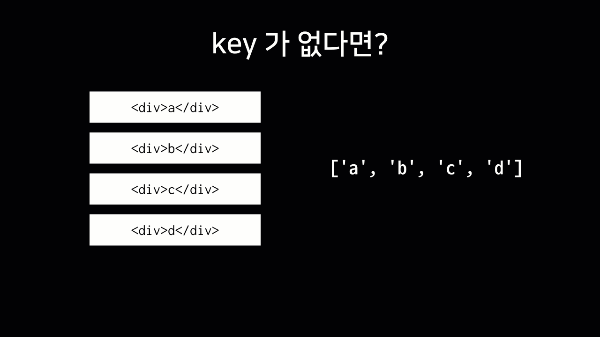
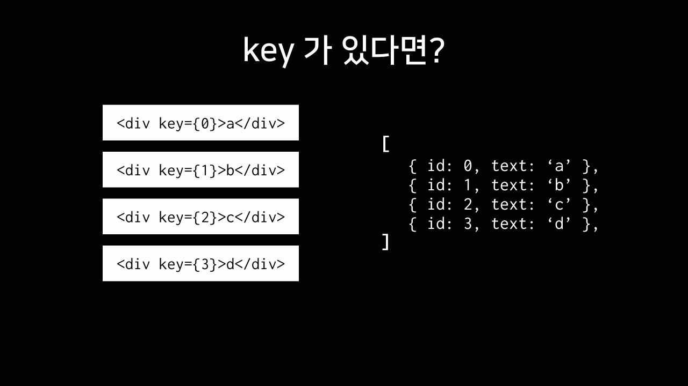

# 리액트 입문

### 최신 흐름을 추구하는 리액트 강좌

* 프론트 영역의 변화는 극심하지만 최신 흐름을 파악하는 것을 목표로 함.
* 현재 상황에서는 클래스 컴포넌트의 도퇴되는 과정과, Hooks 와 Functional Component 의 부흥이 꼽혀진다 \(2019년 기준\)

### 리액트는 어쩌다가 만들어졌을까? 

```markup
<h2 id="number">0</h2>
<div>
  <button id="increase">+1</button>
  <button id="decrease">-1</button>
</div>
```

```javascript
const number = document.getElementById('number');
const increase = document.getElementById('increase');
const decrease = document.getElementById('decrease');

increase.onclick = () => {
  const current = parseInt(number.innerText, 10);
  number.innerText = current + 1;
};

decrease.onclick = () => {
  const current = parseInt(number.innerText, 10);
  number.innerText = current - 1;
};
```

* 간단한 카운트를 행하는 소스다.
*  `DOM` 을 직접 다루거나 이벤트가 더 많아 지는 경우에는 관리하기 매우 까다로워 진다.
* `react`는 대상이 되는 `component`를  특정한 규칙에 의해서 업데이트를 하는 것이 아닌, 새로 만드는 것에 대해서 사상을 가지고  있다.
* 매번 복잡한 구조의 컴포넌트를 새로 만든다면 시간 낭비일 수 있으나, `virtual DOM` 이라는 것을 통해서 성능적인 이슈도 해결했다고 한다. 


* `react`가 `DOM`을 `Rendering` 하는 과정
  * RealDOM &lt;--&gt; VirtualDOM 비교 과정
  * 일치하지 않는 것을 patch 과정을 통해서 부분적인 업데이트를 진
  *  이로서 전체적인 것을 다시 그리는 행위를 취하지 않고 성능도 지켜나갈 수 있다.
  * 고로 어떻게 업데이트 하냐의 관점이 아닌 어떻게 보여줄 지에 집중이 필요하다고 한다.

### 작업환경 준비 

* `Node.js` 설치
* `yarn`\(더 빠른 설치\) or `npm` 중 취향적인 선택
* 본인인 intellij 에서 프로젝트를 함. 

### 나의 첫번째 리액트 컴포넌트 

* 이미 클래스, 함수형 스타일의 컴포넌트를 실습했다.

### JSX 

* `JSX` 에서 선언하는 태그는 반드시 닫혀야한다.
* N개 이상의 태그는 하나로 감싸야하고 감싸는 용도로 보통 `<div>` 를 사용하는 편이나 이마저도 싫다면 편법으로는 fragment를 사용한다. 
* `javascript` 변수를 `JSX` 내에서 사용하고 자하는경우 `{}`를 사용하면 된다.
* `JSX` 내에서 style 은 객체 형태로 지정해야한다. 그리고 camelCase 형식으로 지정해야한다.
* `JSX` 내에서 `css`의 class 를 지하는 것은 className으로 사용해야 한다.
* 주석을 작성하는 법은 제시해줬으나 사용하고 싶지 않다. `{}` 사용

### props 를 통해 컴포넌트에게 값 전달하기 

#### props의 개요

```javascript
import React from 'react';

function Hello(props) {
  return <div>안녕하세요 {props.name}</div>
}

export default Hello;
```

* 부모에서 자식 컴포넌트로 값을 전달하는 용도로 사용한다.

#### 번거로운 props 과정을 생략하는 비 구조화 할 

```javascript
import React from 'react';

function Hello(props) {
  return <div style={{ color: props.color }}>안녕하세요 {props.name}</div>
}

export default Hello;
```

* 매번 위와 같은 구조로 `props.` 과 같은 과정으로 호출하게되면 상당히 귀찮기 마련이다. 비 구조화 할당을 통해서 바로 사용하고자 하는 값을 곧바로 쓸 수도 있다. 
* 아래와 같은 구조로 사용하는 것이 비 구조화 할당이라 명명한다.

```javascript
import React from 'react';

function Hello({ color, name }) {
  return <div style={{ color }}>안녕하세요 {name}</div>
}

export default Hello;
```

#### defaultProps 로 기본값을 할당해보자

```javascript
import React from 'react';

function Hello({ color, name }) {
  return <div style={{ color }}>안녕하세요 {name}</div>
}

Hello.defaultProps = {
  name: '이름없음'
}

export default Hello;
```

* 다음과 같이  `Hello` 컴포넌트에 `defaultProps` 를 활용하는 법을 배웠다.

#### `props.children` 로 컴포넌트 태그사이의 값 조회하

```javascript
import React from 'react';

function Wrapper() {
  const style = {
    border: '2px solid black',
    padding: '16px',
  };
  return (
    <div style={style}>

    </div>
  )
}

export default Wrapper;
```

* 컴포넌트를 래핑하기 위한 용도의 별도의 컴포넌트이다.

```javascript
import React from 'react';
import Hello from './Hello';
import Wrapper from './Wrapper';

function App() {
  return (
    <Wrapper>
      <Hello name="react" color="red"/>
      <Hello color="pink"/>
    </Wrapper>
  );
}

export default App;
```

* `Wrapper` 를 특정 컴포넌트에서 사용하려면 위와 같은 형태에서는 사용이 불가하기 때문에 `Wrapper`에서 `props.children` 을 활용해야한다.

```javascript
import React from 'react';

function Wrapper({ children }) {
  const style = {
    border: '2px solid black',
    padding: '16px',
  };
  return (
    <div style={style}>
      {children}
    </div>
  )
}

export default Wrapper;
```

* 이전 항목에서 배운 비구조화 할당을 활용하면 위와 같이 간략하게 작성이 가능해졌다.

### 조건부 렌더링 

#### isSpecial 사용자 정의 props 설정 및 활용해보기

```javascript
import React from 'react';
import Hello from './Hello';
import Wrapper from './Wrapper';


export default function App() {
  return (
    <Wrapper>
      <Hello name="react" color="red" isSpecial={true}/>
      <Hello name="react" color="red" isSpecial/>
      <Hello color="pink" />
    </Wrapper>
  )
}
```

* 간단한 삼항 연산자로 조건부 렌더링을 실습해보았다.
* 다양하게 `props` 값을 설정할 수 있으나, 자바스크립트 값을 쓰기위해선 `{}`를 사용한다. 
* 또한 `props` 값을 생략하면 default value 는 `true` 이다.

#### 조금더 축약된 표현을 활용해 본다면..

```javascript
import React from 'react';

export default function Hello({color, name, isSpecial}){
    return (
      <div style={{color}}>
          {isSpecial ? <p>*</p> : null}
          {isSpecial && <p>*</p>}
          안녕하세요 {name}
      </div>
    );
}
Hello.defaultProps = {
    name : '이름 없음'
};
```

* 우리가 단순히 보이고 안 보이고 수준의 표기용도이라면 `&&` 연산자를 고려해보는 것도 나쁘지 않다.

### useState 를 통해 컴포넌트에서 바뀌는 값 관리하기 

#### 사용자 인터렉션에 변화에 따른 구현 방법

* 리액트 16.8 버전 이전에는 함수형 컴포넌트로 `state`를 관리할 수 없었다.
* 이후 버전부터 Hooks의 등장으로 정식적인 기능은 아니였으나 많은 리액트 유저들이 이용한다.
* 맛보기로 `Hooks`의 `useState` 를 활용하여  함수형 컴포넌트의 동적인 부분에 대응해본다.



```javascript
import React, {useState} from 'react'

export default function Counter() {
    const [number,setNumber] = useState(0);
    const onIncrease = () => {
        setNumber(number+1);
    };
    const onDecrease = () => {
        setNumber(number-1);
    };
    return (
      <div>
          <h1>{number}</h1>
          <button onClick={onIncrease}>+1</button>
          <button onClick={onDecrease}>-1</button>
      </div>
    );
}
```



```javascript
import React, {useState} from 'react'

export default function Counter() {
    const numberState = useState(0);
    const number = numberState[0];
    const setNumber = numberState[1];
    const onIncrease = () => {
        setNumber(number+1);
    };
    const onDecrease = () => {
        setNumber(number-1);
    };
    return (
      <div>
          <h1>{number}</h1>
          <button onClick={onIncrease}>+1</button>
          <button onClick={onDecrease}>-1</button>
      </div>
    );
}
```



* 엘리먼트에 이벤트를 설정 시 `xxxMethod()`와 같은 형태 호출하여로 넣게되면 `DOM`이 렌더링 되기 전에 실행되버리므로 오류가 난다. 

### input 상태 관리하기 

```javascript
import React,{useState} from 'react'

export default function InputSample() {
    const [text, setText] = useState('');

    const onChange = (e) => {
        setText(e.target.value);
    };

    const onReset = () => {
        setText('');
    };

    return (
        <div>
            <input onChange={onChange} value={text}/>
            <button onClick={onReset}>초기화</button>
            <div>
                <b>값: {text}</b>
            </div>
        </div>
    );
}
```

### 여러개의 input 상태 관리하기 

```javascript
import React,{useState} from 'react';

export default function InputSample() {
    const [inputs, setInputs] = useState({
       name: '',
       nickname: ''
    });

    const {name, nickname} = inputs; // 비 구조화 할당으로 값 추출 : {name: "", nickname: ""}
    console.log(inputs);
    const onChange = (e) => {
        const {value, name} = e.target;
        setInputs({
           ...inputs, // 기존 객체를 복사후
           [name]: value //name 키를 가진 값을 value 로 변경
        });
    };
    const onReset = () => {
        setInputs({
            name: '',
            nickname: ''
        })
    };

    return (
        <div>
            <input name="name" onChange={onChange} value={name} placeholder="이름" />
            <input name="nickname" onChange={onChange} value={nickname} placeholder="닉네임" />
            <button onClick={onReset}>초기화</button>
            <div>
                <b>값: </b>
                {name} ({nickname})
            </div>
        </div>
    );
}
```

* 여러 개의 `DOM`을 다룰 경우 단순히 `useState`, `onChange` 를 여러개 만드는 방법이 쉬울 수 있으나 좋은 방법은 아니다. 해서 `name`을 설정하여 이벤트 발생시 이 값을 참조하여 관리하는 방법이다.
* 리액트에서는 다음과 같은 연관배열이나 프로퍼티를 통해직접적인 수정을 하면 안된다.
  * `inputs[name] = value`
* 대신에 새로운 객체를 생성하여 새 객체에 변화를 주고 이것을 상태로 사용해야 한다.
  * ```javascript
    setInputs({
        ...inputs, 
        [name]: value
    });
    ```
* 위와 같이 기존 객체를 통해서 새로운 객체를 생성해 나가며 불변성을 지켜나가야만 리액트 컴포넌트에서 상태가 업데이트 됨을 감지하고 필요해 의하여 리렌더링이 진행된다.
* 만약 직접 수정하는 경우 값이 바뀌어도 리렌더링이 되지 않는다.

### useRef 로 특정 DOM 선택하기 

#### DOM을 선택해야하는 상황과 리액트에서 처리하는 방향

* 리액트에서 직접적으로 `DOM`을 선택해야 하는 상황이 있다.
  * 엘리먼트의 크기, 위치, 포커스 설정
  * 외부 라이브러리
* 위와 같은 상황일 경우 리액트에서는 `ref` 라는 것을 사용한다.
* 함수형 컴포넌트의 경우 `Hook`의 `useRef` 함수를 사용.
* 클래스형 컴포넌트의 경우 `React.createRef` 함수를 사용.

#### 특정 DOM의 포커싱에 대해 처리해보자

```javascript
import React, {useState, useRef} from 'react'

export default function InputSample() {
    const [inputs, setInputs] = useState({
        name: '',
        nickname: ''
    });
    const nameInputs = useRef();
    const {name, nickname} = inputs;

    const onChange = e => {
        const {value, name} = e.target;
        setInputs({
            ...inputs,
            [name]: value
        })
    };

    const onReset = () => {
        setInputs({
            name: '',
            nickname: ''
        });
        nameInputs.current.focus();
    };

    return (
        <div>
            <input
                name='name'
                placeholder='이름'
                onChange={onChange}
                value={name}
                ref={nameInputs}
            />
            <input
                name='nickname'
                placeholder='별명'
                onChange={onChange}
                value={nickname}
            />
            <button onClick={onReset}>초기화</button>
            <div>
                <b>값 : </b>
                {name}({nickname})
            </div>
        </div>
    );
}
```

* `useRef()` 를 사용하여 `Ref` 객체 생성하여 선택하고자하는 `DOM` 요소에 `ref` 값으로 설정한 코

### 배열 렌더링하기 

#### 배열 데이터 처리 변천



```javascript
import React from 'react';

export default function UserList() {
    const users = [
        {
            id: 1,
            username: 'godchiken',
            email: 'godchiken@naver.com'
        },
        {
            id: 2,
            username: 'tester',
            email: 'tester@example.com'
        },
        {
            id: 3,
            username: 'liz',
            email: 'liz@example.com'
        }
    ];
    return (
        <div>
            <div>
                <b>{users[0].username}</b> <span>({users[0].email})</span>
            </div>
            <div>
                <b>{users[1].username}</b> <span>({users[1].email})</span>
            </div>
            <div>
                <b>{users[2].username}</b> <span>({users[1].email})</span>
            </div>
        </div>
    );
}
```



```javascript
import React from 'react';

function User({user}) {
    return (
        <div>
            {user.username}({user.email})
        </div>
    );
}

export default function UserList() {
    const users = [
        {
            id: 1,
            username: 'godchiken',
            email: 'godchiken@naver.com'
        },
        {
            id: 2,
            username: 'tester',
            email: 'tester@example.com'
        },
        {
            id: 3,
            username: 'liz',
            email: 'liz@example.com'
        }
    ];
    return (
        <div>
            <User user={users[0]}/>
            <User user={users[1]}/>
            <User user={users[2]}/>
        </div>
    );
}
```



```javascript
import React from 'react';

function User({user}) {
    return (
        <div>
            {user.username}({user.email})
        </div>
    );
}

export default function UserList() {
    const users = [
        {
            id: 1,
            username: 'godchiken',
            email: 'godchiken@naver.com'
        },
        {
            id: 2,
            username: 'tester',
            email: 'tester@example.com'
        },
        {
            id: 3,
            username: 'liz',
            email: 'liz@example.com'
        }
    ];
    return (
        <div>
            {
                users.map(user =>(
                    <User user={user}/>
                ))
            }
        </div>
    );
}
```



* 각 배열 요소를 사용하여 자식 컴포넌트를 구성하고 활용해보고, 앞으로 배열의 요소가 늘어날 경우를 대비한 동적인 구성에 대해서 배웠다.

#### key Props


* 리액트에서 배열을 랜더링시 `key`라는 `props`를 설정해야 한다. 

```javascript
return (
    <div>
        {
            users.map(user =>(
                <User user={user} key={user.id}/>
            ))
        }
    </div>
);
```

* 고유한 값을 다음과 같이 `key props`에 설정해본다. 왜 귀찮게 해야 하는가 생각이 들 수 있다.



* 리렌더링 때, 해당 변화를 주고자하는 컴포넌트의 인덱스와 상관없이 모든 컴포넌트를 순차적으로 변경하는 과정을 취한다.



* 특정 인덱스의 컴포넌트에 변화를 주려면 고유 값을 알아야 원하는 곳만 변화를 줄 수 있다.  

### useRef 로 컴포넌트 안의 변수 만들기 

#### useRef의 또다른 용도

* 컴포넌트 내부에서 조회 및 수정이 가능한 변수를 관리하는 용도
* 값이 변경이 되어도 컴포넌트 리렌더링에 관여하지 않는다.
* 일반적인 컴포넌트는 상태를 바꾸는 함수를 호출 -&gt; 랜더링 이후에 업데이트 된 상태를 조회하는 반면 useRef는 관리하고 있는 변수를 설정 이후 바로 조회가 가능하다.

#### 위 용도를 통한 다양한 관리 사례

* 비동기 이벤트를 통해 생성된 고유값 \(ex: id값\)
* 외부 라이브러리를 통해 생성된 인스턴스
* scroll 위치

#### 직접 실습하여 보자 

```javascript
const nextId = useRef(4);
const onCreate = () => {
    nextId.current+=1;
}
```

### 배열에 항목 추가하기



```javascript
import React from 'react';

export default function CreateUser({ username, email, onChange, onCreate }) {
    return (
        <div>
            <input
                name="username"
                placeholder="계정명"
                onChange={onChange}
                value={username}
            />
            <input
                name="email"
                placeholder="이메일"
                onChange={onChange}
                value={email}
            />
            <button onClick={onCreate}>등록</button>
        </div>
    );
}

```



```javascript
import React,{useRef, useState} from 'react';
import UserList from "./UserList";
import CreateUser from "./CreateUser";

export default function App() {
    const [inputs,setInputs] = useState({
        username: '',
        email: ''
    });
    const {username, email} = inputs;
    const onChange = e => {
        const {value,name} = e.target;
        setInputs({
            ...inputs,
            [name] : value
        })
    };
    const [users,setUsers] = useState([
        {
            id: 1,
            username: 'godchiken',
            email: 'godchiken@naver.com'
        },
        {
            id: 2,
            username: 'tester',
            email: 'tester@example.com'
        },
        {
            id: 3,
            username: 'liz',
            email: 'liz@example.com'
        }
    ]);

    const nextId = useRef(4);
    const onCreate = () => {
        const user = {
            id : nextId.current,
            username,
            email
        };
        setUsers([...users,user]);
        setInputs({
            username : '',
            email: ''
        });
        nextId.current += 1;
    };
    return (
        <>
            <CreateUser
                username={username}
                email={email}
                onChange={onChange}
                onCreate={onCreate}
            />
            <UserList users={users} />
        </>
    );
}
```



```javascript
import React from 'react';

function User({ user }) {
    return (
        <div>
            <b>{user.username}</b> <span>({user.email})</span>
        </div>
    );
}

export default function UserList({ users }) {
    return (
        <div>
            {users.map(user => (
                <User user={user} key={user.id} />
            ))}
        </div>
    );
}
```



* 부모컴포넌트 `App`에서 `state` 관리를 하며, `input` 엘리먼트에 필요한 함수들을 `prop` 를 넘겨서 실습.
* `CreateUser` 에서 비구조화 할당을 통하여 `props`에서 필요한 변수, 함수를 전달받는다.
* `App` 에서 자식 컴포넌트 `CreateUser`에서 사용할 `props` 를 관리한다.

#### 배열에 대한 변화를 줄 시 주의점

* 불변성을 지키기 위해 배열의 `push`, `splice`, `sort` 등의 함수를 사용할 경우 새로운 배열에 복사하여 사용한다. 간편하게 사용하고 싶을 때는 다음의 두가지 방법을 따른다.
  * `spread` 연산자
  * `concat`\(\) : 기존 배열을 수정하지 않고 새로운 배열을 생성

### 배열에 항목 제거하기 



```javascript
import React from 'react';

export default function CreateUser({ username, email, onChange, onCreate}) {
    return (
        <div>
            <input
                name="username"
                placeholder="계정명"
                onChange={onChange}
                value={username}
            />
            <input
                name="email"
                placeholder="이메일"
                onChange={onChange}
                value={email}
            />
            <button onClick={onCreate}>등록</button>
        </div>
    );
}
```



```javascript
import React,{useRef, useState} from 'react';
import UserList from "./UserList";
import CreateUser from "./CreateUser";

export default function App() {
    const [inputs,setInputs] = useState({
        username: '',
        email: ''
    });
    const {username, email} = inputs;
    const onChange = e => {
        const {value,name} = e.target;
        setInputs({
            ...inputs,
            [name] : value
        })
    };
    const [users,setUsers] = useState([
        {
            id: 1,
            username: 'godchiken',
            email: 'godchiken@naver.com'
        },
        {
            id: 2,
            username: 'tester',
            email: 'tester@example.com'
        },
        {
            id: 3,
            username: 'liz',
            email: 'liz@example.com'
        }
    ]);

    const nextId = useRef(4);
    const onCreate = () => {
        const user = {
            id : nextId.current,
            username,
            email
        };
        setUsers([...users,user]);
        setInputs({ username : '', email: '' });
        nextId.current += 1;
    };
    const onRemove = id => {
        setUsers(users.filter(user => user.id !== id))
    };
    return (
        <>
            <CreateUser
                username={username}
                email={email}
                onChange={onChange}
                onCreate={onCreate}
            />
            <UserList users={users} onRemove={onRemove}/>
        </>
    );
}
```



```javascript
import React from 'react';

function User({ user, onRemove }) {
    return (
        <div>
            <b>{user.username}</b> <span>({user.email})</span>
            <button onClick={() => onRemove(user.id)}>삭제하기</button>
        </div>
    );
}

export default function UserList({ users, onRemove }) {
    return (
        <div>
            {users.map(user => (
                <User user={user} key={user.id} onRemove={onRemove}/>
            ))}
        </div>
    );
}
```



### 배열에 항목 수정하

### useEffect를 사용하여 마운트/언마운트/업데이트시 할 작업 설정하기 

### 

### useMemo 를 사용하여 연산한 값 재사용하기 


### useCallback 를 사용하여 함수 재사용하기 


### React.memo 를 사용한 컴포넌트 리렌더링 방지 


### useReducer 를 사용하여 상태 업데이트 로직 분리하기 


### 커스텀 Hooks 만들기 


### Context API 를 사용한 전역 값 관리 


### Immer 를 사용한 더 쉬운 불변성 관리 


### 클래스형 컴포넌트 


### LifeCycle Method 


### componentDidCatch 로 에러 잡아내기 / Sentry 연동 


### 리액트 개발 할 때 사용하면 편리한 도구들 - Prettier, ESLint, Snippet 


### 리액트 입문 마무리


